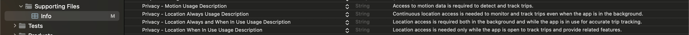

# iOS Quick Start Guide for BlinkSDK

Welcome to the BlinkSDK iOS Quick Start Guide! This document will help you set up and integrate BlinkSDK into your iOS application.

## Platform Requirements

- **iOS Version:** 13.0 or higher
- **Development Environment:** Latest iOS SDK via Xcode

## Dependency Requirements

- **TensorFlowLiteC:** To build and run on M1 Mac simulators, use our custom TensorFlow Lite framework.

## Getting Started

### 1. Using CocoaPods

CocoaPods is a dependency manager for Objective-C and Swift projects that simplifies the management of third-party libraries.

#### Steps to Install BlinkSDK Using CocoaPods:

1. **Open Your Project in Xcode:** Navigate to your project directory and open your Xcode project.

2. **Create or Update Your Podfile:**
   - If your project does not already have a Podfile, create one by running `pod init` in the terminal from your project directory.
   - If you already have a Podfile, proceed to update it.

3. **Edit Your Podfile:**
   - Open your Podfile (located in your project directory) and add the following line to include BlinkSDK:

     ```ruby
     pod 'BlinkSDK'
     ```

4. **Install the Pod:**
   - Save the Podfile and run `pod install` in the terminal. This will download and install BlinkSDK and its dependencies into your project.

5. **Open the Workspace:**
   - From now on, open your project using the `.xcworkspace` file, not the `.xcodeproj` file. This is necessary for CocoaPods to manage the dependencies correctly.

   For more information, you can visit the [CocoaPods Documentation](https://cocoapods.org/).

### 2. Using Swift Package Manager (SPM)

Swift Package Manager is a tool for managing Swift and Objective-C project dependencies.

#### Steps to Install BlinkSDK Using Swift Package Manager:

1. **Open Your Project in Xcode:**
   - Navigate to your Xcode project.

2. **Add the Package:**
   - Go to `File -> Add Packages...` in the Xcode menu.

3. **Enter the Package URL:**
   - In the search bar, enter the following URL:

     ```plaintext
     https://github.com/blinkappnet/BlinkSDK-iOS.git
     ```

4. **Select the Package:**
   - Choose **BlinkSDK** from the search results.
   - Set the version rule to **"Up to Next Minor Version"** and specify the target SDK version.

5. **Add the Package to Your Project:**
   - Select your project from the "Add to Project" section.
   - Click **Add Package**.

6. **Wait for Product Selection:**
   - After adding the package, a dialog will appear for you to select which products from the BlinkSDK package you want to include in your project.
   - Select **BlinkSDK** and any other products you need.

**Swift Package Products:**

The Blink SDK Swift Package includes various products. Ensure you select the products that fit your needs for your project.


## Project Settings

After integrating the BlinkSDK into your project, you need to configure your project settings to ensure proper functionality.

### 1. Configuring Capabilities

To set up the necessary capabilities for BlinkSDK:

1. **Open Your Project in Xcode:**
   - Navigate to your Xcode project and select your target.

2. **Go to the Capabilities Tab:**
   - Click on the **Capabilities** tab for your target settings.

3. **Enable Required Background Modes:**
   - Under the **Background Modes** section, enable the following options:
     - **Location updates**
     - **Background fetch**
     - **Background processing**


## 2. Adding Permissions

The BlinkSDK requires specific permissions to function correctly. These permissions need to be granted by users during the app's onboarding process. The SDK itself does not request these permissions; you must present the appropriate dialogs to explain why each permission is necessary.

### Required Permissions

#### Location Permissions:

- **Background Location Access**
  - **Reason:** To collect location data even when the app is not in the foreground.
  - **Details:** The BlinkSDK requires "Always" location access to monitor and track trips accurately. "Precise Location" must also be enabled in the app's location settings for accurate data collection. Without this permission, the SDK's detection capabilities will be limited.

  **Info.plist Keys:**
  - `NSLocationAlwaysUsageDescription`: Explains why continuous location access is needed.
  - `NSLocationWhenInUseUsageDescription`: Explains why location access is needed when the app is open.
  - `NSLocationAlwaysAndWhenInUseUsageDescription`: Explains why location access is needed both in the background and when the app is open.

#### Motion & Fitness Permissions:

- **Motion Activity Access**
  - **Reason:** To collect motion activity data which enhances detection accuracy.
  - **Details:** While this permission is not mandatory, granting it improves the quality of trip detection. The SDK uses motion data to better identify and track trip starts.

  **Info.plist Key:**
  - `NSMotionUsageDescription`: Explains why access to motion data is required.

### Example Info.plist Configuration

Add the following keys to your `Info.plist` file to provide necessary descriptions for the permissions:

```xml
<key>NSMotionUsageDescription</key>
<string>Access to motion data is required to detect and track trips.</string>

<key>NSLocationAlwaysUsageDescription</key>
<string>Continuous location access is needed to monitor and track trips even when the app is in the background.</string>

<key>NSLocationAlwaysAndWhenInUseUsageDescription</key>
<string>Location access is required both in the background and while the app is in use for accurate trip tracking.</string>

<key>NSLocationWhenInUseUsageDescription</key>
<string>Location access is needed only while the app is open to track trips and provide related features.</string>
```




## 3. Usage

### Initial Setup

To set up the BlinkSDK, you need to initialize the SDK in your `AppDelegate`'s `didFinishLaunchingWithOptions` method and configure it with your API key.

**Swift Code:**

```swift
import BlinkSDK

@UIApplicationMain
class AppDelegate: UIResponder, UIApplicationDelegate {

    func application(_ application: UIApplication, didFinishLaunchingWithOptions launchOptions: [UIApplication.LaunchOptionsKey: Any]?) -> Bool {
        Blink.shared.configure(apiKey: "YOUR_API_KEY") { isWorking, error in
            if let error = error {
                print("[BlinkSDK] Error: \(error)")
            } else {
                print("[BlinkSDK] isWorking: \(isWorking)")
            }
        }

        Blink.shared.didFinishLaunching(application, didFinishLaunchingWithOptions: launchOptions)
        return true
    }
}
```
## Adding Observers

To listen to various modules, add observers for the modules you need:

**Swift Code:**

```swift
Blink.shared.addTripStatusObserver(self)
Blink.shared.addTripTrackingObserver(self)
Blink.shared.addAccidentDetectionObserver(self)
Blink.shared.addDriverBehaviorObserver(self)
```

## Implementing Observer Protocols

### TripStatusObserver

Handle trip status updates by implementing the `TripStatusObserver` protocol:

**Swift Code:**

```swift
extension YourViewController: TripStatusObserver {
    func didStartTrip(at location: CLLocation) {
        // Handle trip start
    }

    func didEndTrip(at location: CLLocation) {
        // Handle trip end
    }
}
```

### TripTrackingObserver

Handle trip location updates by implementing the `TripTrackingObserver` protocol:

**Swift Code:**

```swift
extension YourViewController: TripTrackingObserver {
    func didUpdateLocation(_ location: CLLocation) {
        // Handle location update
    }
}
```

### AccidentDetectionObserver

Handle accident detection by implementing the `AccidentDetectionObserver` protocol:

**Swift Code:**

```swift
extension YourViewController: AccidentDetectionObserver {
    func didDetectAccident(severity: Int32, speed: Double) {
        // Handle accident detection
    }
}
```

### DriverBehaviorObserver

Handle driver behavior incidents by implementing the `DriverBehaviorObserver` protocol:

**Swift Code:**

```swift
extension YourViewController: DriverBehaviorObserver {
    func didEncounterIncident(_ incidentType: BlinkSDK.IncidentType, severityLevel: Int) {
        // Handle driver behavior incident
    }
}
```

### DriverBehaviorObserver

Handle driver behavior incidents by implementing the `DriverBehaviorObserver` protocol:

**Swift Code:**

```swift
extension YourViewController: DriverBehaviorObserver {
    func didEncounterIncident(_ incidentType: BlinkSDK.IncidentType, severityLevel: Int) {
        // Handle driver behavior incident
    }
}
```

### Incident Types

The `IncidentType` enum defines various types of incidents:

**Swift Code:**

```swift
public enum IncidentType: Int {
    case normal
    case brake
    case cornering
    case acceleration
    case swerve
    case drifting
    case overSpeed
    case makeCalls
    case replyCalls
    case texting
    case startCharging
    case stopCharging
    case headSetCall
    case headSetReply
}
```

## Example Implementation

To help you get started, example files demonstrating the implementation of BlinkSDK in a sample project are provided. You can find these examples in the `Examples` folder of our repository. These examples cover various use cases and provide a practical guide on how to integrate and utilize BlinkSDK in your application.

## Conclusion

You are now ready to integrate and use BlinkSDK in your iOS application.

If you have any questions or run into issues, feel free to open an issue on our [GitHub repository](#) or contact our support team.

Happy coding!
